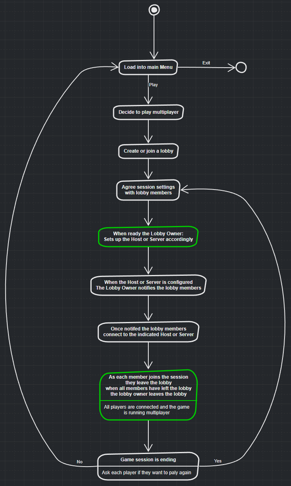

# Multiplayer

## Introduction

Designing a multiplayer game introduces unique challenges, especially regarding network architecture, game state synchronization, and player interactions. In addition to gameplay design, multiplayer games often involve ongoing live operations costs, as servers and matchmaking systems require maintenance and resources to function effectively.

Choosing the right multiplayer architecture early in development is critical, as it impacts both gameplay design and technical feasibility. While multiplayer games traditionally fall into a few categories, modern hybrid solutions, such as the Steam API's networking model, offer additional options.

Understanding these different models and concepts is essential to making the right decision for your game.

### Multiplayer Models Overview

There are several fundamental models for multiplayer games, and each has its advantages, drawbacks, and implementation complexities. The key models typically used are:

* **Local Multiplayer**
* **Online Multiplayer (Client-Server and Listen Server models)**
* **Dedicated Server Model**

#### Local Multiplayer

Local multiplayer refers to gameplay where multiple players interact on a single machine. This was common in early arcades and console games. Typically, players share input devices like controllers or keyboards, each controlling a character or aspect of the game. The main benefit of this model is simplicity, as it avoids network issues entirely.

#### Remote Play 

A unique feature of Steam. This takes a game that was designed for Local multiplayer and uses game streaming technology (Steam's Link) to enable a remote player to play with you as if they were on the couch with you.



This is simply streaming the game over the Steam client so the other players do not require a copy of the game or even a machine that can run the game, they do however require a network connection suitable for streaming the game over the wire. Implementing this requires Steam API ... and Heathen has you covered there but it's out of scope for this article.

#### Online Multiplayer

In online multiplayer, players connect over the internet, each running a local instance of the game. The network facilitates the synchronization of game states, allowing remote players to interact within the same game world. This model involves more complex systems to handle latency, synchronization, and reliable connections.

### Concepts of Networked Multiplayer

**Client**

A client is a version of the game that runs on a player’s machine, handling player input (keyboard, mouse, controller) and displaying the game world. The client is responsible for rendering graphics, processing player commands, and managing local game states.

**Listen Server**

A Listen Server is a game session where one of the players' machines also acts as the server. This means the host player's machine both runs the game and handles the networking responsibilities of the server. While this model can be resource-intensive for the host machine, it eliminates the need for dedicated server infrastructure, making it ideal for small-scale multiplayer experiences (e.g., small co-op games, LAN parties). The host machine often has a direct connection with all other clients in the session, which simplifies the network structure but can introduce challenges if the host has limited resources.

**Dedicated Server**

A Dedicated Server is a special version of the game designed purely to serve client requests without running any of the gameplay visuals or rendering components. This type of server typically operates on powerful machines (cloud services, private data centers) that can handle many simultaneous players. Dedicated Servers can scale better than Listen Servers and are usually preferred for larger-scale multiplayer games where reliability, consistency, and persistence are key. The server doesn't participate in gameplay itself; its sole function is to host the game and synchronize the state for all connected players.

***

## Network Topologies

Network topology refers to how different game clients and servers are connected and how they interact. Understanding network topology is vital for optimizing performance and scalability.

### Star Topology

In Star Topology, all clients (players) connect to a central server (either a Listen Server or a Dedicated Server). This is the most common topology for smaller multiplayer games. It offers simplicity in design but has limitations in scalability, as the central server becomes a bottleneck when many clients are connected.

**Advantages**:

* Simplicity in setup and maintenance.
* Easy to manage with centralized control.
* Best suited for games with moderate player counts.

**Disadvantages**:

* The central server can become a performance bottleneck.
* Latency increases with more clients connected.

### Mesh Topology

In Mesh Topology, every client is directly connected to every other client. This means that the loss of one client won’t disrupt the game state, as other clients can still communicate directly. This model is less common today because it can overwhelm the network with traffic and increase the chances of desynchronization.

**Advantages**:

* No central server needed.
* Each client has direct control over their game state.

**Disadvantages**:

* Difficult to scale efficiently with many players.
* High network traffic due to multiple connections.

### Hybrid or Distributed Topology

Hybrid or Distributed Topologies mix elements of both Client-Server and Mesh models. For example, in a "sharded" MMO, players connect to different "shards" of the game world, which are handled by separate server instances. This model offers scalability while still allowing central management of data and game state.

**Advantages**:

* Highly scalable for large player bases.
* Can balance load across multiple servers.

**Disadvantages**:

* Complex infrastructure and more difficult to manage.
* Requires extensive backend services for synchronization.

***

## Key Multiplayer Workflows

A typical multiplayer game involves two main phases: **Discovery** and **Gameplay**.

<figure><figcaption></figcaption></figure>

#### Discovery

Discovery refers to how players find each other or the servers they want to join. This includes browsing through matchmaking systems, inviting friends, or automatically pairing players in a "Quick Match."

Common methods include:

* **Lobby Systems**: Where players gather before starting a match, often with options for customization and matchmaking.
* **Quick Match**: A matchmaking system that automatically pairs players with others based on predefined criteria.
* **Party Systems**: Players form a party and then search for a game together.
* **Drop-in/Drop-out**: Allows players to join or leave a session during gameplay, common in games like ARPGs or co-op shooters.

#### Gameplay

Gameplay refers to the actual playing of the game, where players interact with each other in real-time. Two common types of multiplayer gameplay models are:

* **Session-based**: The game world only exists during active play. When the session ends, the world is unloaded, and all data is discarded (or persisted if necessary).
* **Persistent**: The game world is always running, even when players aren't actively playing, such as in MMOs. Servers persist, allowing players to log in at any time and interact with an ongoing game world.

***

## Live Operations (LiveOps)

Live Operations (LiveOps) refer to the set of services and backend systems used to support a game after launch. These systems are often separate from the core game and provide a variety of features such as matchmaking, player stats, and in-game events. LiveOps can significantly enhance a player's experience and keep a game fresh long after launch.

#### Common LiveOps Features:

* **Authentication**: Ensures players can securely log into the game and their accounts.
* **Cloud Saving**: Allows players to save their progress online and access it from multiple devices.
* **Matchmaking**: Helps players find suitable opponents or teammates.
* **Leaderboards & Achievements**: Tracks and rewards players for their in-game accomplishments.
* **Microtransactions**: Handles the sale of in-game items or currency.

***
