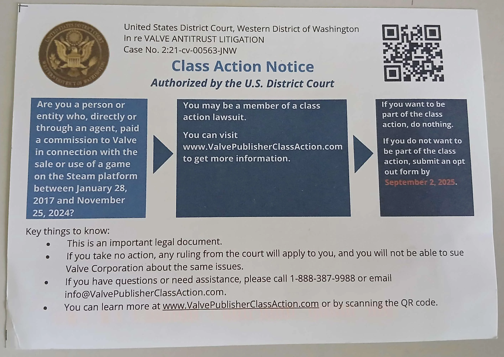

# Valve Class Action Suit

Some of you may have received a letter or email about a **class action lawsuit against Valve**. It looks official and can seem intimidating — especially if English isn't your first language.

<figure><figcaption></figcaption></figure>

#### ❓ What's This All About?

This is a **U.S. class action lawsuit** claiming Valve's pricing policies are anti-competitive. The court has not decided anything yet, and **Valve has not been found guilty**.

The notice was sent to many developers who sell games on Steam — it doesn’t mean you're in trouble. It just means you might be affected if the case goes forward.

***

### 💡 Our Recommendation: Consider Opting Out

In our opinion, this lawsuit is **frivolous** and unlikely to benefit small or indie developers. By staying in the class:

* You **give up the right to sue Valve yourself** over this issue later.
* You become part of a legal case that **doesn't reflect most developers’ views** of the platform.

If you **opt out**, you:

* Keep your legal rights.
* Don’t participate in any judgment or payout.
* Avoid being associated with what may be a poor legal precedent.

***

### 📚 Want to Learn More?

Here are friendly sources with more background:

* **YouTube**: Search “Valve class action 2024”\
  Creators like _Hoeg Law_ or _Virtual Legality_ often cover these topics well.
* **Game News Sites**:
  * [Rock Paper Shotgun](https://www.rockpapershotgun.com/that-lawsuit-against-steams-30-cut-of-game-sales-is-now-a-class-action-meaning-many-other-developers-could-benefit)
  * [PC Gamer](https://www.pcgamer.com/gaming-industry/the-antitrust-lawsuit-against-steam-is-now-a-class-action-and-that-could-have-big-repercussions-for-valve/)
  * [IGN](https://www.ign.com/articles/a-new-lawsuit-accuses-valve-of-abusing-its-power-to-keep-pc-game-prices-high)

These sites have coverage written with devs and gamers in mind.

***

### 🚪 How to Opt Out (Recommended)

To remove yourself from the lawsuit:

1. Go to 👉 [https://www.valvepublisherclassaction.com/opt-out](https://www.valvepublisherclassaction.com/opt-out)
2. Fill in your info (Notice ID, Confirmation Code). This should be found on the notice you received
3. Submit&#x20;

Note the deadline to opt out is 2nd September 2025

***

You don’t need a lawyer, and this doesn’t affect your current Steam games or business.

If you're unsure, reach out in our dev chat, happy to help clarify it as best we can. Remember, we are not legal counsel, just fellow developers like yourselves, so this is a peer-to-peer conversation, not legal advice.
