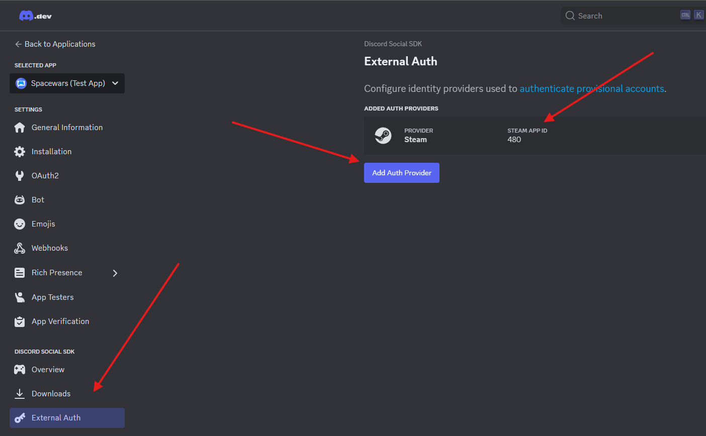

# Authentication

## Quick Start

TL;DR ... the Initialize Discord Social component script will handle initialization for you and provides 3 simple functions you can use to "connect" the API with.



Discord’s default OAuth flow clearly shows its web-based heritage—lots of fragile string juggling and multi-step boilerplate. We abstract that away while keeping the full feature set.

## 🔓Public Clients,

For standard public apps:

* On first run, just call:,

```csharp
DiscordSocialApp.Connect();
```

We'll handle the full auth flow: launch the browser/device code, process the result, fetch your tokens, and connect the SDK.

* Your tokens will be exposed so you can persist them.,
* On future runs, skip the dance and simply call:,

<pre class="language-csharp"><code class="lang-csharp"><strong>DiscordSocialApp.Connect(token, expirationDate, refreshToken);
</strong></code></pre>

We’ll validate and refresh tokens as needed and reconnect automatically.

## 🔐Confidential Clients,

For confidential apps (e.g., games using a backend service):

* Call:,

```csharp
DiscordSocialApp.RequestAuthorizationCode();
```

We’ll handle authorization and return the code via event.

* You must send the code to your backend for exchange.,

Follow Discord’s official guide here: 👉 [Server-to-Server Token Exchange](https://discord.com/developers/docs/discord-social-sdk/development-guides/account-linking-with-discord#servertoserver-get-token-exchange)

* Once your backend sends the tokens back to the client, call:,

```csharp
DiscordSocialApp.Connect(token, expirationDate, refreshToken);
```



Coming Soon



## What Discord Offers

Discord's Social SDK provides two primary authentication methods:

* **OAuth2 account linking**: Standard flow allowing users to connect their existing Discord account—unlocking features like DMs, friends lists, invites, voice, and rich presence.
* **Provisional accounts**: Temporary Discord identities created for users without Discord accounts—enabling lobbies, voice chat, presence, invites, and basic social features—without formal login.&#x20;



These options ensure every player can access key social features, regardless of whether they have a Discord account.

### How It Works in Practice

* You initialize the SDK and choose an authentication path.
* If linking, you perform standard OAuth2: requesting permissions, retrieving tokens, and establishing a Discord connection.
* If provisioning, users receive limited, auto-managed Discord IDs, enabling social features without requiring login.
* The result is a consistent API surface—unified lobbies, messaging, presence, and invites.

***

## Provisional Accounts

This is far more applicable to live service games with a an account management aspect to them that do not have an underlying platform (Steam, XBox, etc.). The feature is available on all platforms however so if you design your game to be dependent on Discord Lobby for example player's can still leverage those features without needing to link a Discord account.

For clients (your game client) you will need to make it a "public client" in order to leverage the Provisional token option in authentication. You can read more on the [use of Provisional Accounts on Discord](https://discord.com/developers/docs/discord-social-sdk/development-guides/using-provisional-accounts) developer portal.

## Design Considerations

The following are tips from Discord and will be expanded on my Heathen and our community as the Discord Social SDK expands and develops.

### Before the user connects

[Discord recommends](https://discord.com/developers/docs/discord-social-sdk/design-guidelines/signing-in#before-the-user-connects) and Heathen agrees, a one-time "user education" as Discord calls it is the best approach. The idea here is simple, show a dialogue or other informative UI element at an appropriate time such as on first run of the game or when the user first touches your game's social features. This dialogue should:

* Only appear once, you should have the setting in your system settings so they can disable/enable at will but don't "pop up" on your player more than once.
* Inform the user why this might be of value to them. What are the features they gain access to (friends list, lobbies, chat, voice, rich presence, etc.)
* If the user has already indicated they want the game integrated with DIscord then use the auto connect feature provided by Heathen to make it seamless, it should just be there and working for them until they turn it off.

### After the user connects

Here we disagree slightly with [Discord's recommendation](https://discord.com/developers/docs/discord-social-sdk/design-guidelines/signing-in#after-the-user-connects) Heathen recommends getting out of the way once you have your answer from the "user education" you should handle the rest seamlessly and transparently to the game.&#x20;

Discord's recommendation for note us a success message with blurbs about what you can do. To Heathen this feels redundant, and in our opinion gamers want to play games not read status messages or be sold on a feature they have already accepted but use your own judgement.

### Error State

Here again we disagree slightly with [Discord's recommendation](https://discord.com/developers/docs/discord-social-sdk/design-guidelines/signing-in#error-state) Heathen recommends errors be handled gracefully, which in an entertainment medium usually means delt with for the player so they don't have to. A small icon or similar indicating a notification they can check at their leisure that informs them of the specific error as best you can and offers to try again or redirect them should be the extent of it in our opinion.

Discord's recommendation is very "marketing-esk" focused, show a generic message and a "call-to-action" advertising speak for redirect them to try again. Why so different from Heathen's, in Heathen's opinion showing a detailed error is useful for troubleshooting and debugging, a generic platitude is not useful for this. As to our reasoning for keeping it minimal and out of the way, simple, Discord is a "value add" to the game, it is not the game so it should stay out of the way at all times.

### Connection Points

The idea of a connection point is the areas in your game where the player might be giving the opportunity to login to Discord. [Discord's Recommendations](https://discord.com/developers/docs/discord-social-sdk/design-guidelines/connection-points) here are a bit heavy handed in Heathen's professionally opinion. Each game is unique so there isn't a one size fits all but in general we would say your game should be the only thing your game is advertising to the player, "Blurple Discord buttons" are probably not "on brand" for your game.

Heathen's recommendation is a one-time, on first-run of the game informational telling them about the feature then get out of the way and never mention it again. The setting should be in the settings where all players would expect it to be. In the settings by all means display a "Blurple Discord button"

## Examples

### Connect

When your player has indicated they want to link their Discord account and authorize your "app" that is your game. This feature will require the user to authorize your app and once done will enable you to quickly and efficiently authenticate the user and access their social data.



You have two options for directly connecting.&#x20;

### Public Clients

If this is the first time your app has connected call Connect with no parameters.&#x20;

```csharp
DiscordSocialApp.Connect();
```

This will trigger the Discord to pop and overlay or modal requesting the user to "Authorize" your app to have access to their account. Assuming they accept the process will continue generating the appropriate tokens.

Once the process is complete assuming no errors the resulting Token, RefreshToken and TokenExperation will be available to you. You should store these values in a secure manner appropriate to your app.

```csharp
string myToken = DiscordSocialApp.Token;
string myRefreshToken = DiscordSocialApp.RefreshToken;
DateTime myTokenExperationDate = DiscordSocialApp.TokenExpiration;
```

***

### Confidential Clients

In this case your game client cannot get tokens and so must generate an Authentication Code that will be passed on to your trusted backend servers who will get the actual tokens.

```csharp
DiscordSocialApp.RequestAuthorizationCode();
```

This will go as far requesting authorization and receiving the required authorization code at which point `OnAuthorizeResult` will be invoked providing the required code. Its then up to you to send that code to you trusted backend and get the required codes. [Please see Discords documentation for more information](https://discord.com/developers/docs/discord-social-sdk/development-guides/account-linking-with-discord#servertoserver-get-token-exchange).

With your tokens now available you can call&#x20;

```csharp
DiscordSocialApp.Connect(myToken, myTokenExperationDate, myRefreshToken);
```

***

### Using Stored Tokens

In the event you have connected before you can skip "Authorization" and use the existing tokens.

```csharp
DiscordSocialApp.Connect(myToken, myTokenExperationDate, myRefreshToken);
```

The system will automatically check the expiration date and if passed will attempt a refresh invoking the `OnReceivedToken` event if successful. or the `OnRetrieveTokenFailed` if it failed. In the event of failure you should generally call `DiscordSocialApp.Connect();` to start the process anew.

## Events

The Discord Social SDK initialisation and connection process passes through a number of steps in the background. Each step is represented by a Unity Event you can listen to if desired. All events are part of the DiscordSocialApp static class, the same class you used to call Initialise and Connect.


The only event that matters is OnReady, which is triggered when the entire system is ready to be used.


### OnAuthorizeResult

```csharp
public static UnityEvent<ClientResult, string, string> OnAuthorizeResult
```

Triggers when OAuth authorisation provides the required callbacks.

### OnConnect

```csharp
public static UnityEvent OnConnect
```

Triggers when the system completes the connection.

### OnDisconnect

```csharp
public static UnityEvent OnDisconnect
```

Triggers when the system disconnects from Discord.

### OnReady

```csharp
public static UnityEvent OnReady
```

Triggered when the system state updates to Ready and is thus ready to be used.

### OnReceivedToken

```csharp
public static UnityEvent OnReceivedToken
```

Triggard, when token retrieval completes&#x20;

### OnRetrieveTokenFailed

```csharp
public static UnityEvent OnRetrieveTokenFailed 
```

Triggered when the token request responds with a state of failed.

### OnStatusChanged

```csharp
public static UnityEvent<Client.Status, Client.Error, int> OnStatusChanged
```

Triggers with every system state change, connecting, connected, ready, disconnecting, disconnected, etc.



Coming Soon



### Get Provisional Token

In the case you have a user that doesn't wish to link their discord you can create a provisional account based on some external token.&#x20;


Working with Steamworks?\
Great using Heathen's Toolkit for Steamworks you can leverage Get Steam Provisional Token and let us handle the boiler plate.


To use External Authentication for provisional accounts you need to enable External Auth for each provider you support. In your [Discord Developer Portal](https://discord.com/developers/applications) and configure each provider you plan on using.

<figure><figcaption></figcaption></figure>



```csharp
DiscordSocialApp.GetProvisionalToken(
    AuthenticationExternalAuthType externalAuthType, 
    string externalAuthToken);
```

The externalAuthType is the type you wish to use and must be enabled as an External Auth option in your portal.

The exteranlAuthToken is the string representation of that types ticket or token.

Keep in mind provisional tokens expire after 1 hour, you will need to request a new token after that by calling GetProvisionalToken again.

The event

```csharp
public static UnityEvent OnTokenExpiration
```

Triggers when the token expires, activities in progress will not be interrupted but new requests will fail silently until the token is renewed.



Coming Soon



### Get Steam Provisional Token

In the case you have a user that doesn't wish to link their discord you can create a provisional account based on their Steamworks Authentication Ticket. This assumes your using [Heathen's Toolkit for Steamworks](https://app.gitbook.com/s/kfE3ZAs6TeNW5sBM2C3i/).

To use External Authentication for provisional accounts you need to enable External Auth for each provider you support. In your [Discord Developer Portal](https://discord.com/developers/applications) and configure each provider you plan on using.

<figure><figcaption></figcaption></figure>

With Steam provider configured you can use Heathen's tools to quickly integrate with Steam Authentication.



```csharp
DiscordSocialApp.GetSteamProvisionalToken();
```

Keep in mind provisional tokens expire after 1 hour, you will need to request a new token after that by calling GetSteamProvisionalToken again.

The event

```csharp
public static UnityEvent OnTokenExpiration
```

Triggers when the token expires, activities in progress will not be interrupted but new requests will fail silently until the token is renewed.



Coming Soon




