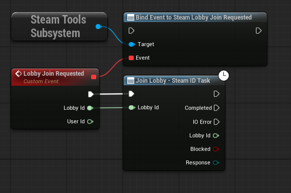

# What's new in 2026

Toolkit for Steamworks 2026 is available on [GitHub](https://github.com/sponsors/heathen-engineering), through [Patreon](https://github.com/sponsors/heathen-engineering?frequency=patreon) and on the [Unity Asset Store](https://assetstore.unity.com/publishers/5836).


We have delisted Unreal Marketplace / FAB.\
The FAB store does not provide the required features for us to adequately support our clients there. \
\
If you're looking for the Unreal Engine version of our toolkits, sponsor us on [GitHub Sponsors](https://github.com/sponsors/heathen-engineering) or via [Patreon](https://github.com/sponsors/heathen-engineering?frequency=patreon), where you get access to our Source Repo containing the source code of all of our assets for all engines for **$15**


## Unity

### Events

In previous versions you would have accessed global events for each API end point in its respective static class for example<br>

```csharp
API.Matchmaking.Client.EventGameLobbyJoinRequest
```

These have been moved to a new unified static class

```csharp
SteamTools.Events
```

The events in this static class are traditional C# events and replace all "global" events you would have previously accessed via API.\<Interface>.\<Target>.&#x20;

> Note the naming of events was updated \
> \
> EventGameLobbyJoinRequest\
> \
> now takes the form of\
> \
> OnLobbyJoinRequest

The Steamworks Event Trigger component is still available and still exposes all of these events as Unity Events to the Unity Inspector.

<figure><figcaption></figcaption></figure>

### Name Changes

There are a number of name changes between 2025 and 2026. Most of these are a matter of normalising our naming convention, for example

* evtSomeEvent

Has become

* onSomeEvent

and our boolean fields such as

* Valid

Has become

* IsValid

### Configuration

<figure><figcaption></figcaption></figure>

We have made some subtle but important changes to how configuration is handled in Toolkit for Steamworks. You will use Player > Steamworks settings as you have before; now, however, we track what the current app is and update a scripting define when you change this value. Please note this will cause a recompile when changed.

This means for each "app" you define, there will be a corresponding scripting definition, such as

```csharp
#if APP480
// Code that only works with your main app
#elif APP490
// Code that works with ... whatever 490 is your Demo or a Playtest, for example
#endif
```

You will also note that DLC, Server Config and Inventory have all been moved to a Global section. Previously, you defined each for each app you had; now we manage a single shared set of each.

### Modular Components

Modular Components replace the older "manager" model. In 2026, there are a few "manager" types still floating around; however, these will be deprecated and replaced by modular components in due course.

So what is a "Modular" component?

It's simply a family of very small, bite-sized components, each responsible for a very specific bit of functionality. for example

* Steam Lobby Data
* Steam Lobby Data Events
* Steam Lobby Create
* Steam Lobby Invite
* etc

#### Modular Inspector

Don't worry, this doesn't mean you're adding 42 little components to every GameObject to get it to do what you want. We have a smart inspector inspired by PostProcessing and Cinemachine that lets you add and remove functionality quickly and easily, and displays everything as a single component.

For example ... this:

<figure><figcaption></figcaption></figure>

And this:

<figure><figcaption></figcaption></figure>

They are the same component. The first example is a fully functional Steam Lobby UI handling sync with a party lobby, displaying member lists, handling create, invite and join operations and more.

The second is a simple display, showing the lobby Name, Max Slots and current Member Count ... suitable for displaying lobbies in a browser, for example.

Both are simple configurations of the Lobby component.

#### Browsing

<figure><figcaption></figcaption></figure>

We have made it easier to browse our components; each of these is the "top-level" component. You can add it and then use it to add additional functionality. We will be expanding on the Modular System, so let us know what you think about it and how you would like to see it progress.

### SteamTools

We have added a new `Namespace,` SteamTools. This namespace is a simpler, more direct access to core features and replaces the SteamSettings and related Scriptable Objects feature in prior versions of the toolkit.

#### SteamTools.Interface

Working in code? Then use:

```csharp
SteamTools.Interface.WhenReady(RunWhenReady);
```

RunWhenReady can be any function you want to run as soon as possible, but only after Steamworks SDK and your game's Steam artefacts, such as Input, Leaderboards and Inventory, are ready to work with.

```csharp
void RunWhenReady()
{
    // This will run after the Steamworks SDK and all my Steam game features are ready.
}
```

There is no need to create a coroutine or register an event. You can, of course, still use Boolean checks or events if you prefer.

```csharp
if(SteamTools.Interface.IsReady)
{
    // Ready to go!
}
```

or

```csharp
SteamTools.Interface.OnReady += Handle_OnReady;
```

```csharp
void Handle_OnReady()
{
    // Ready to go!
}
```

You can also find error messages and easy access to `IsDebugging` in this class.

```csharp
SteamTools.Interface.IsDebugging = true;

if(SteamTools.Interface.IsInitalized)
    // Steamworks SDK is ready ... your game may not be

if(SteamTools.Interface.IsReady)
    ;// both the Steamworks SDK and your Steam game objects are ready

SteamTools.Interface.OnInitializationError += Handle_OnInitError;

void Handle_OnInitError(string message)
{
    // Something went wrong
}
```

#### SteamTools.Authenticate

Quick access to authentication and provisioning ... this will be expanded upon as the Discord Social SDK matures. Two useful quality of life features can be found here ... with more to come!

```csharp
// Generate an authentication ticket for a server and send it to that server
SteamTools.Authenticate.SendToRpcWhenReady(serverId, ServerRpcCallback, ErrorCallback)
```

For example, your ServerRpcCallback might look like this.


Specific implementation will depend on the HLAP (NetCode, PurrNet, FishNet, Mirror, etc.) you chose. This is simply an example; the SendToRpcWhenReady will call the function you point it at when the ticket is ready. \
The BeginSession function will validate the result and call a simplified function when ready.\
\
The objective of these tools is to reduce the event and callback juggling you need to.


```csharp
[ServerRpc]
private void ServerRpcCallback(ulong userId, byte[] ticket)
{
    SteamTools.BeginSession(userId, ticket, OnSessionCallback);
}

private void OnSessionCallback(
    EBeginAuthSessionResult result
    , AuthenticationSession session)
{
    if(result == EBeginAuthSessionResult.k_EBeginAuthSessionResultOK)
    {
        switch(session.Response)
        {
            // Handle each response case
        }
    } 
    else
    {
        // Invalid ticket of some sort
    }
}
```

### SteamTools.Game

<figure><figcaption><p>See <a href="configuration/unity-configuration.md">Unity Configuration</a> for more details.</p></figcaption></figure>

Generated from your configuration, SteamTools.Game is a static class that contains hardcoded values for each of your Steam artefacts. This greatly simplifies mult-app development, removes the need for any kind of object reference, making it far more data-oriented and memory-oriented friendly, and of course enables our "Modular Components" to understand your game at dev time.

The resulting `SteamTools.Game` class is aware of the "Active Application", meaning it will conditionally compile values based on which app you have your game set to. There is no need to regenerate when switching apps, only if you add or remove steam artefacts such as stats, leaderboards, achievements, inventory items, etc.

The resulting static class has the following features.

#### SteamTools.Game.AppId

A static constant value that is your current App

#### SteamTools.Game.DLC

This contains each of your DLC as static `DlcData` values, for example, in Spacewars, we would have

```csharp
SteamTools.Game.DLC.pieterw_test_DLC
// and
SteamTools.Game.DLC.ticket_test_DLC
```

These can then be used to check ownership, open store pages, etc.

#### SteamTools.Game.ServerConfiguration

Defines the default configuration for your Steam Game Server if you defined one. We have also provided handy tools for reading server configuration from disk as an INI or JSON.

These will read the data from disk and update the `ServerConfiguration`. You should do this before calling for `SteamTools.Interface.Initialize();`

```
SteamTools.Game.ServerConfigFromIni(filePath);
// or
SteamTools.Game.ServerConfigFromJson(filePath);
```

#### SteamTools.Game.Initialize()

This will initialise Stamworks SDK as the active app, it will then ready all of your artefacts such as Steam Input and Leaderboards and when complete, it will notify via SteamTools.Interface.Ready.

#### SteamTools.Game.Stats

This contains each of your stats as static `StatData` values. For example, in Spacewars, we would have

```csharp
SteamTools.Game.Stats.AverageSpeed
SteamTools.Game.Stats.FeetTraveled
SteamTools.Game.Stats.MaxFeetTraveled
SteamTools.Game.Stats.NumGames
SteamTools.Game.Stats.NumLosses
SteamTools.Game.Stats.NumWins
SteamTools.Game.Stats.Unused2
```

These can be used to set and read values for each.

#### SteamTools.Game.Achievements

This contains each of your achievements as static `AchievementData` values, for example, in Spacewars, we would have

```csharp
SteamTools.Game.Achievements.ACH_TRAVEL_FAR_ACCUM
SteamTools.Game.Achievements.ACH_TRAVEL_FAR_SINGLE
SteamTools.Game.Achievements.ACH_WIN_100_GAMES
SteamTools.Game.Achievements.ACH_WIN_ONE_GAME
SteamTools.Game.Achievements.NEW_ACHIEVEMENT_0_4
```

These can be used to read state and unlock achievements.

#### SteamTools.Game.Leaderboards

This contains each of your leaderboards as static `LeaderboardData` values. For example, in Spacewars, we would have

```csharp
SteamTools.Game.Leaderboards.Feet_Traveled
```

These can be used to upload and read entries, attach files, etc.

#### SteamTools.Game.Inputs

This contains your Sets, Layers and Actions as static element values, for example, in Spacewars, we would have

```csharp
// Sets
SteamTools.Game.Inputs.Sets.menu_controls
SteamTools.Game.Inputs.Sets.ship_controls
// Layers
SteamTools.Game.Inputs.Layers.thrust_action_layer
// Actions
SteamTools.Game.Input.Actions.analog_controls
SteamTools.Game.Input.Actions.backward_thrust
SteamTools.Game.Input.Actions.fire_lasers
SteamTools.Game.Input.Actions.forward_thrust
SteamTools.Game.Input.Actions.menu_cancel
// etc ...
```

These can be used to activate sets, read input data, etc.

#### SteamTools.Game.Inventory

This contains your Steam Inventory Items as static `ItemData` values. Spacewars doesn't actually have items, but as an example.

```csharp
SteamTools.Game.Inventory.IronSword
SteamTools.Game.Inventory.BronzeSword
SteamTools.Game.Inventory.WoodSword
```

These can be used to perform inventory actions such as

* Start Purchase
* Read the quantity the player owns
* Consume
* Exchange / Craft

Etc.

## Unreal

We have delisted our tools from FAB.


Get Toolkit for Steamworks and more for Unreal Engine via our [GitHub](https://github.com/sponsors/heathen-engineering) and [Patreon](https://github.com/sponsors/heathen-engineering?frequency=patreon) offerings.


The FAB store is simply not fit for purpose with tools like ours, where we need the ability to push updates across all supported versions of the engine, where we need the ability to offer discounted upgrade paths between versions and importantly, where you can easily and cleanly install our toolkits as project-level plugins ... Not just engine-level plugins.

We had attempted to work with Epic on these topics; however, they are not a priority for them. As such, we have delisted our assets from FAB, as opposed to tolerating the inferior customer experience and lack of critical version support.

We will continue to monitor FAB's progress. When and if it implements the required features, we will consider distribution through it again.&#x20;

### Steam Tools Subsystem

The most significant change from 2025 is the removal of the Steam Game Instance and the replacement of it with the Steam Tools Subsystem.

<figure><figcaption></figcaption></figure>

This means you no longer need to create a bespoke Game Instance to use our Toolkit for Steamworks. The new Steam Tools Subsystem has all of the same features as the older Steam Game Instance base class, including delegates (events) for each of Steamworks' global events and the ability to initialise the Steamworks SDK in PIE if you so choose.

### Task Nodes

We have added new task nodes to most asynchronous operations in the toolkit.

<figure><figcaption></figcaption></figure>

The original "Callback" version still exists for those (like me) who prefer that approach.

<figure><figcaption></figcaption></figure>

### Single Code Base

We have adjusted our codebase to more easily support a wider range of Unreal Engine versions with a single code base. As we are no longer bound by some of the opinions enforced by FAB, we can more easily support older versions of the Unreal Engine.

Currently, we have built and tested back to 5.0

All plugin exports are now identical in code base, with the only difference being the metadata for the plugin itself, as that unfortunately specifies the engine version.

We will continue to prepare, ready to drag and drop packages for each supported version, and you should find it much easier to upgrade engine versions going forward.
