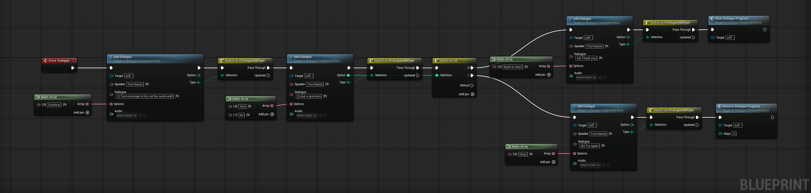

# Dialogue System


**Note: These tools are in preview**\
We follow a “dogfood” development approach—these tools are actively used and developed within our current WIP games. They are mature enough to share with our GitHub and Patreon supporters, so their documentation is provided here for early adopters.


The Dialogue System is a designer-friendly tool built to support modular, branching conversations with audio, UI, and logic control fully encapsulated within a single Actor Component. It is built on Unreal Engine’s **UCommonActivatableWidget** framework and is designed for extensibility and ease of use by non-programmers.

## What It Is

The system centres around a `UDialogueComponentBase` that designers extend via Blueprint (optionally C++) to define specific conversations. All dialogue logic is implemented within the `Event Dialogue` node in Blueprint, providing a highly intuitive, node-based interface for creating branching narrative flows.

### &#x20;Core Features

* **Activatable Widget Integration**: Conversations are managed through the Common UI framework. `OpenConversation()` instantiates and pushes a dialogue widget onto the stack.
* **Designer-Driven Flow**: The `Dialogue()` event is called when a conversation begins or progresses. Designers use `Add Dialogue` Blueprint nodes to define steps.
* **Index-Based Progression**: Internally tracks conversation progress via `ActiveIndex`. Each `Add Dialogue` call increments this index.
* **Stateful Traversal**: If a dialogue step has already been visited (tracked via `ActiveProgress`), the system automatically passes through it to re-enter the correct state.
* **Dynamic UI Updates**: On encountering a new dialogue index, `Add Dialogue` updates the widget's speaker text, body, and options. Optional voice-over audio can also be played.
* **Player Choice Handling**: When the player selects an option in the widget, it calls `UpdateSelectedOption()`, which records the choice and triggers `ProgressDialogue()` to continue the flow.
* **Branching Support**: Built-in `SetDialogueBranch()` allows the system to store and swap between progress states tied to named dialogue branches.
* **Runtime Tools**: Designers can:
  * `Clear Dialogue Progress()` – reset to the start.
  * `Remove Dialogue Progress(N)` – roll back a number of steps.
  * `Close Dialogue()` – exit and clean up the widget.
* Designers can use any Blueprint nodes they like to test answers, modify options or control dialogue branching
* Dialogue state is tracked as simple index values e.g. the index of the step and the index of the option chosen, making it trivial and compact to save conversation state.

## Designer Workflow

<figure><figcaption></figcaption></figure>

1. Create an Actor Component derived from `DialogueComponentBase`.
2. Implement `Event Dialogue` to define the flow using `Add Dialogue` nodes.
3. Optionally attach audio assets to each line.
4. Connect the component to any actor (e.g. NPCs).
5. Call `OpenConversation()` from gameplay triggers or interactions.

#### Example Flow

* `OpenConversation()` → creates the widget → calls `ProgressDialogue()`.
* `ProgressDialogue()` → increments index → calls `Dialogue()`.
* Designer’s `Dialogue()` logic responds by calling `Add Dialogue(...)`.
* If dialogue at current index is new, UI updates with speaker, line, options.
* Player selects an option → triggers `UpdateSelectedOption()` → loops again.
