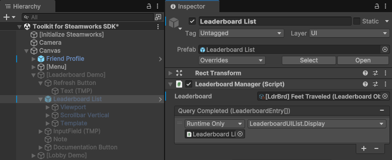

# Session Lobby

<figure><figcaption></figcaption></figure>


#### Like what your seeing?

Consider supporting us as a [GitHub Sponsor](../../../../../company/become-a-sponsor.md) and get instant access to all our Unity assets, exclusive tools and assets, escalated support and issue tracking and our gratitude.\
\
These articles are made possible by our [GitHub Sponsors](https://github.com/sponsors/heathen-engineering) ... become a sponsor today!


## Introduction&#x20;

This is a simple "matchmaking" lobby, that is its used to gather players together before starting a multiplayer session. This is the most common "primary use case" we see for Steam Lobby.

<figure><figcaption></figcaption></figure>

### Features

#### Quick Match

The standard approach, simply the player clicks "Play" and the system will search for a matching lobby and join it, if none is found it will create a new lobby with the prescribed arguments.

#### Invite Friends

Inviting friends to join the lobby your in ... only useful for "owners" of the lobby.

#### Ready Check

You can see when your friends are "ready" to play via a simple Thumbs up or Clock icon on the lower left of their slot. You set your self as "read" or "waiting" using a simple button press.

#### Owner Flag

See who the owner of the lobby currently is, this shows a star of the owners portrait.

#### Start Session

This is the fun part, having the owner start up a network session, make it ready for players to join and then to notify players that its time to join and how to join.

## User Interface

After the party leader ... or if your not in a party a solo player clicks the "Play" button we perform a Quick Match search via the Lobby Manager tool.

<figure><figcaption></figcaption></figure>

This is a simple process where the system will call `SessionUIController.QuickMatch()` on button press. The QuickMatch function does a few simple checks that are unique to this scene but common for more uses cases.

1. Check if the player is a member of a "Party" and if so are they they owner? \
   If the user is not in a party or if they are the owner of the party then we move on. If the user is a member of a party but is not the owner then we exit ... only the party leader can start a session.
2. We adjust our "Search Arguments" depending on rather or not we are in a party.\
   If the player is in a party then we need to search for a session lobby that can fit our whole party. If not we search for any session lobby, only non-full lobbies will be returned so for solo players this is fine.
3. Finally we simply call `LobbyManager.QuickMatch(true)` this will instruct the LobbyManager to perform a standard quick match using the Search Augments provided. The `true` argument tells it that if no match is found that it should create a new lobby for us.

When this process completes the LobbyManager will invoke&#x20;

### On Joined a Lobby

`SessionUIController.OnJoinedALobby()` this is registered to the LobbyManager's Evt Enter Success event in the Unity Inspector.

This happens when we join an existing lobby as a member not its owner. This is a simple process that performs the following actions.

1. Update the UI\
   So we update the UI so the player knows we are now in a lobby and who we are in a lobby with
2. Check for server\
   We check to see if this lobby has already set a game server and if so we take action on that
3. Authentication\
   This isn't required but such a common feature we show you how to do it here. When a new player joins a lobby we have them send an Authentication ticket via the lobby chat system.

### On Lobby Created

`SessionUIController.OnLobbyCreated(Lobby lobby)` this is registered to the LobbyManager's Evt Created event in the Unity Inspector.

This happens when we have successfully created a lobby, that is we hit the Play button, didn't find a match so the system created a new lobby make us the "owner" of that lobby. This process performs the following actions.

1. Update the UI\
   So we update the UI so the player knows they are now in a lobby and they are the owner of that lobby.
2. Update the lobby metadata\
   As the owner we "own" the lobby and can store data on it. To support the "authentication" demonstration we are doing we have the owner create a storage point in the Lobby metadata here. That is we simply store and empty `SessionSettings` object here. In a more practical use case these settings might have map info, game rules or more. This is not "required" just so common we felt we should demonstrate how.
3. Party ... if we are in a party then we notify the party of the lobby we created. This will be used by the party to have party members join this lobby.

### Start Session

<figure><figcaption></figcaption></figure>

At some point either determined by your game logic or at the whim of the lobby owner it will be time to "start session" ... that is you will want to start playing the game with the players you have.

This process has a few steps and they are unique to your game depending on your game's architecture and design and the tools your game is using e.g. Mirror, NetCode go GameObjects or FishNetworking, etc.

The basic steps are as follows and are demonstrated in our sample scripts in the `SessionUIController.StartGame()` this is what is called in Start Session button's click. This performs the following actions

1. Update the UI\
   We update the UI so the user knows we are "doing work" and what that workd \*\***wold be**\*\* if this was a real game.
2. Set Game Server\
   Don't be caught off by the term, rather its a P2P session or Client Server your still "setting game server" this is how we notify all members of the lobby that the network session is ready to join.

In a real game your workflow would look something like this ... note we describe this in detail in our Multiplayer article. The sample scene doesn't do this because it would be entirely depending on what networking tools your using and what your games architecture is.

1. Owner of lobby loads into the Network Scene additively such that the lobby UI is still loaded.
2. Owner of lobby sets the network scene as the "active" scene such that new spawned objects will be created in this scene
3. Owner of lobby configures the network as required and "starts" it ... in Mirror and FishNet for example the owner would call NetworkManager.StartHost()
4. Owner of lobby initializes any required networking features to make the environment ready for players to join.
5. Owner of lobby calls SetGameServer on the lobby, this notifies all members that the network is ready to join. At this point the owner can unload the Lobby UI scene if they haven't already as we know now that the network session is stable.
6. Once all members of the lobby have joined or abandoned the lobby owner would then exit the lobby ... at this point you are in your network session and Steam Lobby is no longer at play.


Some developers choose to "persist" the lobby thoughout the session to use it as a simple chat or to help gather players into a new session lobby at the end of game play. \
\
This is up to you but we don't recommend it, its nearly always better to use your network for chat and your end of game process is the right place to create a new session lobby for players that want to keep playing together.


For the non-owner members of the lobby the process looks like this

1. The lobby manager's Evt Game Created event will raise when the owner of the lobby calls SetGameServer. This event will provide you with details on how to connect so the member will populate the address info in your network tool of choice
2. Load network scene, the member will load into the correct networking scene and set it as "active"
3. The member will call Start Client starting the network process on the address provided by the Evt Game Created event.
4. The member will unload the Lobby UI scene and can leave the Session Lobby ... at this point the point you are in your network session and Steam Lobby is no longer at play.

## Authentication

While not required it is recommended and commonly done, so we demonstrate it in the Practical Use Case scene.  You can learn more about what [Authentication ](../../guides/authentication.md)is in our guide section. As to the use in lobby we demonstrate a common workflow where in the owner "authenticates" each joining member. This allows the owner to verify Valve Anti-Cheat (VAC) and if your using Steam Inventory it would allow the owner to verify ownership of specific inventory items.

The workflow is simple

1. When a user joins the lobby (other than the owner) they will get and send their Authentication ticket data through the Lobby Chat Director.
2. When a chat message is received, we check if it is a message or if its authentication data. If its authentication data then non-owner user's ignore it. The owner of the lobby will read it and "[Begin Session](../../guides/authentication.md#begin-auth-session)" on that data verifying the user.&#x20;
   1. If the user is authentication the owner can cash that data to the Lobby Metadata so all other users are aware the user has been authenticated
   2. If the user fails authentication such as VAC ban the owner can "kick" that user using Heathen's Lobby Kick system.

## Chat

Lobby chat can be as simple as text messages flying back and forth. That said its far more common to use the Chat system to transport complex serialized data such as authentication tickets. With in the "Practical Use Case Scripts\SessionUIController.cs" you will see a sub structure we use for chat messages that allow for more complex uses of chat.

### ChatMessage

This is a simple serializable structure that helps us send complex data over the lobby chat system and provides us with an easy way to know what that data is and to parse it back. Put more simply when we want to "send" a chat message we create a new ChatMessage object and load it with our data specifying the "type" of message we are sending. When a message is received we use the FromJson feature get our ChatMessage object and we can then act on it accordingly

In the example scene you will that we use ChatMessage to send 3 types of messages

* Authentication\
  This message type is only used by the owner of the lobby and simply carries the ticket data of a user wishing to be authenticated
* Text\
  This message type is used by everyone and is a simple text message from some other player
* Notification\
  This message type is used by everyone and is a simple text message that will original from the owner of the lobby but represents a "system notification" or otherwise not a conversation message from a human but a status update about the lobby
