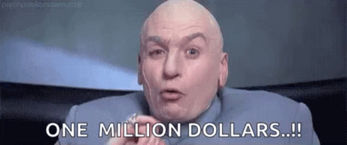

# Pay to Play

The original form of monetization.

Its hard to beat this one, user pays you money, you provide a product as agreed, user players said product.

Really this is the golden ideal for consumers, so why does everything else exist?

Pay to play simply means you have an up-front, one time defined price that people pay ... in order to play your game.

The big issue here isn't with the consumer but the developer/publisher. This isn't really sustainable at scale as sad as that is, it is the reality of it. When you make a one time purchase and then expect life time support and maintenance you are simply living in a dream world. Adding the problem with this consumers have been trained that a "big" "AAA" high end game costs 50-60 USD for the base version. That has been true for decades despite inflation, increasingly large and complex games and increasingly more humane treatment of developers (better salary, benefits, etc.). Some of the inflation issue is offset by the increasingly easy and affordable tools to produce great games but in no world is a unit price of 60 USD suitable.

## Napkin Math

Lets say you charge 60 USD and sale 1,000,000 (1 million units)

So assuming you could create a game that will sale a million units at full price, calculating a very reasonable ... to the point unlikely cheap marketing budget of 10%, tax of 10%, distribution cost of 30% and a staff around 100 strong on average, with an average pay of 50k per for the project life of just 3 years ... which is lightening fast.

You will break even ... that is make no money at all assuming you produce 1 game every 3 years.

60 \* 1,000,000 = 60,000,000\
10% marketing, 10% tax, 30% distribution/ops = 50% split or 30,000,000 net revenue\
Salary per year on average = 5,000,000\
Salary for life of project (3 years) = 15,000,000\
Salary required to live while you make the next game = 30,000,000\
Your now flat broke with a profit of $0 yet there are plenty more expenses to deal with.

Factor in that 3 years is a really fast turn around and assumes no issue, this doesn't account for the general operations cost of doing business. Now that salary ... no, yes many game devs make around 50k, indies offten a lot less, but they also dont finish a game in 3 years or sale a million copies for full price 60 USD. Developers that do that cost closer to 100k per year.

I am simply trying to paint the picture that while Pay to Play can work for small teams dishing out simple low investment content and relying on word of mouth advertising. It just isn't sufficient to prop up an industry at scale. This is why we see Pay to Play being supplemented with so many other models.

## The Factors

### Team Size

Smaller teams mean less overhead in salary. Yes as EA and Activision will tell you ... you could just pay your people less ... but that is flat wrong so go away if slum lording is your plan. The only sustainable answer here is to do more work with fewer bodies. Tools like Unity and and valuable timesaving assets that let you Do More 😉such as Heathen's&#x20;
