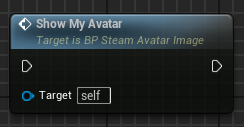

# Installation


#### Like what you're seeing?

Support us as a [GitHub Sponsor](../../become-a-sponsor/) and get instant access to all our assets, exclusive tools and assets, escalated support and issue tracking and our gratitude.\
\
These articles are made possible by our [GitHub Sponsors](../../become-a-sponsor/) ... become a sponsor today!



Video is silent but does have subtitles/captions


<table data-card-size="large" data-view="cards"><thead><tr><th></th><th></th><th></th></tr></thead><tbody><tr><td><h3>GitHub Sponsor</h3></td><td><p><a href="https://github.com/sponsors/heathen-engineering">Become a Sponsor</a></p><p><em>The link below only works for Sponsors</em><br><a href="https://github.com/heathen-engineering/SourceRepo">Installation Instructions</a></p><p>Cancel anytime, and keep everything you have including our site-based license</p><ul><li>$15.00 month</li><li>Source Access<br>For all our assets</li><li>Live Updates</li><li>Exclusive extras</li><li>Issue Tracking</li><li>Escalated Live Support</li><li><p>Unity</p><ul><li>Toolkit for Steamworks</li><li>PhysKit Complete</li><li>UX Complete</li></ul></li><li><p>Unreal</p><ul><li>Toolkit for Steamworks</li></ul></li></ul></td><td></td></tr><tr><td><h3>Unreal Marketplace</h3></td><td><p><a href="https://www.unrealengine.com/marketplace/en-US/product/ad658ddf5c434478acb95f9091ea279c">Unreal Marketplace</a></p><ul><li>$74.99</li><li>Source Included</li><li>Quarterly Updates<br>+ Hotfixes</li><li>Toolkit for Steamworks</li><li>Live Support</li></ul></td><td><mark style="color:orange;">Per-user license, free updates for that major version, discount on future major updates</mark></td></tr></tbody></table>

## Requirements

### Version

You'll need to install Unreal v5.1, 5.2 or 5.3.

### C++

You'll need your project to support C++\
No this doesn't mean you have to use C++, but the engine needs to have the project headers and build process of compiling from C++. So you need to do that.

If you chose a C++ project when you created your project congratz, step done, and move on.

If you chose Blueprint project when you created your project, simply add a C++ class via the Tools menu and Unreal Editor will do the work of setting your project up so it can be completed.

## Installation

### From the Marketplace

The plugin is deployed to the Unreal Marketplace as an engine plugin. This means you need to install the plugin to the engine after purchase in order to be able to use it.

<figure><figcaption></figcaption></figure>

Once you have installed the plugin to the engine versions you require you need to enable the plugin for your project, this will require a restart to complete.

<figure><figcaption></figcaption></figure>

### From GitHub

The plugin will be installed as part of your project as opposed to part of the engine. To get started close your engine, and navigate to the project folder, this is where your .uproject file is located.

You should see a .sln file beside it, if you do not then your project is not set up for C++ so go back a step and fix that.

Once you do have a .sln we need to copy the Plugins in. You may already have a Plugins folder if not simply create one.

#### Add the plugin

Next, copy the SteamworksComplete folder into your Plugins folder. You'll find the plugin in our GitHub Sponsor Source Repo

<figure><figcaption></figcaption></figure>

When done your folder should look similar to the above.

#### Modify the Plugin configuration

If you do not own the Plugin from the Unreal Marketplace then the Epic editor will see that this plugin is also a Marketplace plugin and expect you to download it from there

<figure><figcaption></figcaption></figure>

You have 2 options to sidestep this, 1 you could deploy it as an engine plugin (personly not my preference) or you can modify the SteamworksComplete.uplugin to empty the `MarkeplaceURL` node, as shown below

```ini
{
    ...
    "MarketplaceURL": "",
    ...
}
```

#### Generate files

Next, right-click on the .uproject file and select Generate Visual Studio project files

<figure><figcaption></figcaption></figure>

#### Rebuild

Right-click on your projects .uproject file and select `Generate Visual Studio Project files`. This will cause the engine to scan the project directory and link up all the related bits we just copied in.
